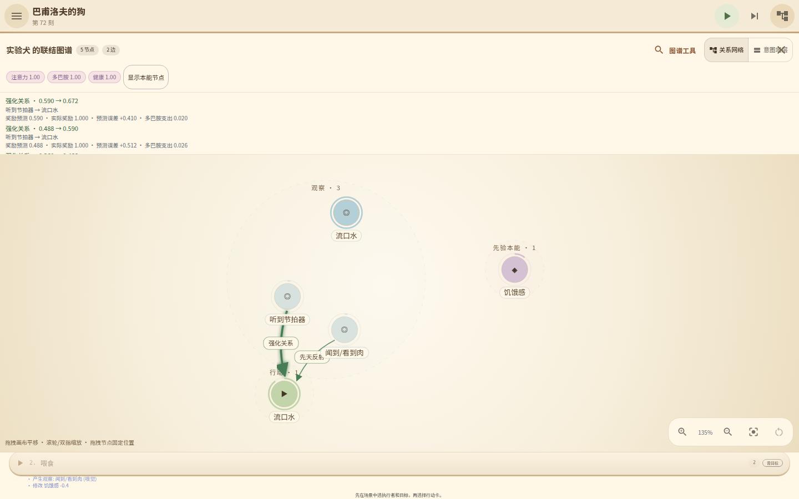
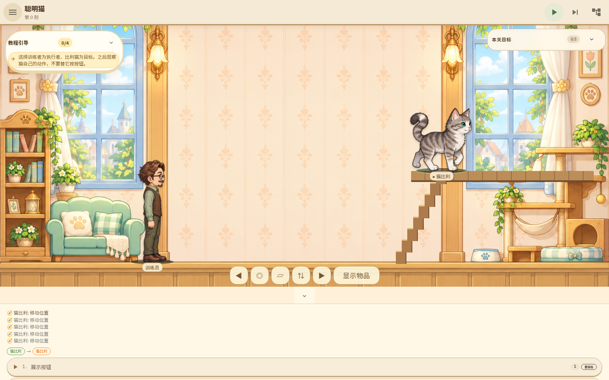

# 实验犬的意义之塔：明亮横卷轴试玩版

验收代码：`c205e8c`。游戏版本：0.9.0；请以提交和构建日期区分旧试玩包。

- [本批完整 CI：全部通过](https://github.com/linonetwo/intention-tower/actions/runs/37802386457)
- [下载 Linux 核心＋网页试玩包](https://github.com/linonetwo/intention-tower/actions/runs/37802386457/artifacts/11561448522)
- [下载实际浏览器截图与权威报告](https://github.com/linonetwo/intention-tower/actions/runs/37802386457/artifacts/11561188173)
- [代码审阅 PR](https://github.com/linonetwo/intention-tower/pull/2)
- [本批 Windows／macOS／Linux 安装包构建：全部成功](https://github.com/linonetwo/intention-tower/actions/runs/37807724392)

直接下载本批安装包（保留至 2026-10-22）：

- [Windows：MSI／EXE](https://github.com/linonetwo/intention-tower/actions/runs/37807724392/artifacts/11564985250)
- [macOS Apple Silicon：DMG／App](https://github.com/linonetwo/intention-tower/actions/runs/37807724392/artifacts/11564236018)
- [Linux amd64：AppImage／DEB](https://github.com/linonetwo/intention-tower/actions/runs/37807724392/artifacts/11563712364)

三平台均基于同一已验收代码 `c205e8c`；这是未完成商店签名和公证的试玩版本。

Linux 包要求 Linux amd64 和 Node 22。解压后按包内 README 启动已编译核心和网页服务，
浏览器打开本机 4173 端口；无需编译或安装依赖。网页并非独立模拟器，所有操作由 Rust 核心执行。
手机横竖屏已通过真实 Chromium 视口与触控尺寸检查，尚未完成手机真机或原生安装包验收。

## 本批体验

场景采用明亮的横向卷轴房间，正式名称与中英内容使用 react-i18next。
房间及角色动作素材通过 proxy-imagegen 调用 GPT Image 2 生成：20 张房间映射 21 关，
研究员、教师、学生和猫／狗／雏鹅各有站立、四帧行走与坐姿。
其余角色使用正式全身素材，尚未全部拥有独立动画。

点击角色选择执行者，再点击空白场景横向行走。点击高度不改变楼层；
接近猫房间楼梯端点后用上下楼按钮切换平台。坐下按钮使用真实坐姿，移动会自动站起。
浪潮人物共用同一地面。物品热点默认收起，可用“显示物品”打开。

顶部仅保留手册、暂停／继续、单步和图谱四项主要操作。
存档、速度、模式等在手册中，短横屏教程也收于手册，不覆盖人物。
图谱保留圆形节点、关系方向、拖动、缩放与学习记录；React 管理 SVG，
`d3-force` 仅用于布局算法，不使用 D3 操作 DOM。

## 建议试玩路线

巴甫洛夫：选择巴甫洛夫与实验犬，在手册关闭自动步进并暂停。
摇铃后单步一次，喂食后单步 11 次，重复 5 轮；最后仅摇铃后单步 11 次。
图谱显示预测误差、真实多巴胺支出与新联结；实测独立响铃通关，另有未训练及消退负例。
启用默认自动步进时，命令本身已包含一步，不要重复计算。

聪明猫：先示范发声按钮并配对食物，等待刺激结束后重复。
随后等待真实饥饿与新的按键动作，在有效窗口内“按键后喂食”。
一次动作只能消费一次奖励，按钮点击次数不算学习成果。
继续训练并留出无外界提示的等待窗口，猫需要凭学到的需求联结自主求食。
当前精确 CI 路线在 tick1142 通关；训练节奏与等待提示仍有改善空间。

雏鹅：选择洛伦兹与雏鹅，关闭自动步进；“靠近雏鹅”后一步形成固定印刻对象，
消耗 0.2 多巴胺。“远离”后一步，再等待真实追随。
先展示诱饵会固定错误对象，需要重开；印刻不是命令次数达标。

## 验收边界

64 个前端测试、70 个 Rust 测试、22 个 BDD 场景／128 个步骤通过。
21 关现有 MCP 路线通过，浏览器覆盖 21 关桌面与竖屏，另含四个短横屏关卡。
狗、猫、雏鹅的学习路线以及移动、楼梯、站坐、存档恢复均有真实运行证据。
共 119 张真实浏览器截图，46 组视口无素材缺失、页面横向溢出或未捕获异常。

这不是“全部 Wiki 设计已完成”或“已可商店上架”的声明。
其他关卡的真实行为机制、剩余角色动画、真机性能、签名与公证仍需完成。
待办仅列于 `docs/todo.md`，完成结果与失败修复记录于 `docs/worklog/2026-10-08.md`。

## 本批实际截图

## 历史构建

[旧三平台安装包](https://github.com/linonetwo/intention-tower/actions/runs/37686641530)
基于 `75bd230`，不含本批明亮横卷轴改动，请勿当作最新版。
[雏鹅旧增量](https://github.com/linonetwo/intention-tower/actions/runs/37696258785)
基于 `fd2890c`。旧截图保留为历史证据，不代表当前界面。
