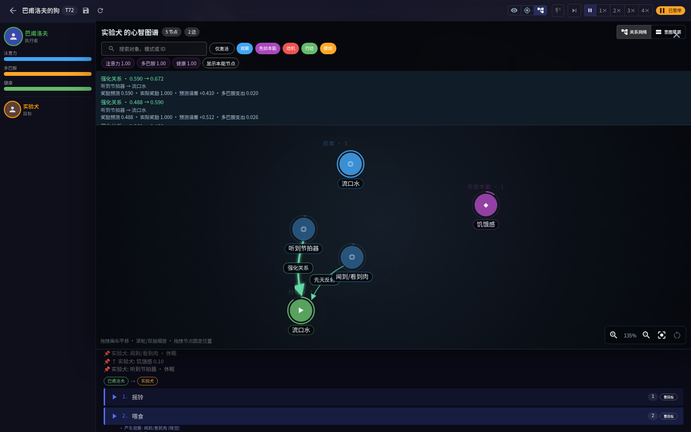
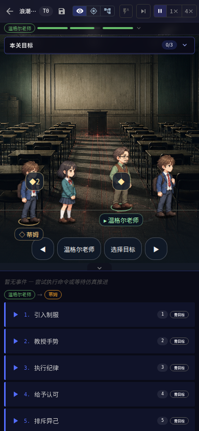

# 正式素材试玩验收

游戏版本：0.9.0。验收提交：`75bd230`。

- [完整 CI 与浏览器证据](https://github.com/linonetwo/intention-tower/actions/runs/37685731500)
- [桌面安装包构建](https://github.com/linonetwo/intention-tower/actions/runs/37686641530)
- [代码审阅 PR](https://github.com/linonetwo/intention-tower/pull/2)

三平台安装包均已成功上传。在构建页面的 Artifacts 区下载对应平台：
`intention-tower-windows`、`intention-tower-macos`、`intention-tower-linux`。
macOS 包为 Apple Silicon（aarch64），Linux 包为 amd64。
这些是试玩产物，不代表已完成商店签名或公证。Artifacts 保留至 2026-10-21。

验收页面同时提供 `standalone-mcp-web-linux`：包含已编译 Linux 核心与网页，
按包内 README 启动，无需本地编译。`real-browser-mcp-evidence` 包含全部实际截图及 JSON 报告。

## 建议试玩路线

巴甫洛夫：暂停时间，选择巴甫洛夫和实验犬。每轮摇铃并步进一次，再喂食；
使用默认自动步进时，按钮已经包含一次步进，不必重复。观察心智图谱的学习记录，
等待本轮刺激结束，再重复配对。训练后单独摇铃，观察条件反应与通关。
CI 使用关闭自动步进的精确路线：摇铃后 1 步，喂食后 11 步，重复 5 轮，
最后仅摇铃后 11 步。学习联结为 0.67232；独立反应后为 0.537856。

聪明猫：展示按钮，再交替示范与真实喂食，不能只重复无奖励示范。
猫真实选择按键动作后，“按键后喂食”才可用。CI 完成 3 轮奖励训练和 3 次
动作后的奖励，在第 49 步通关；无奖励及反向配对均有负例。

## 验收结果

- 29 个前端测试、50 个 Rust 测试、16 个 Cucumber 场景／99 个步骤通过。
- 21 关通过真实 Rust MCP 路线通关。
- 21 关 × 桌面／手机共 42 组视口，另含学习阶段截图，总计 94 张实际浏览器截图。
- 浏览器无未捕获错误；94 次内置中文字库检查通过。
- 21 张背景、55 张肖像、13 份透明全身素材映射至 55 个角色。
  全身素材按角色原型复用，不是 55 套独立动画。
- React 持有 SVG 图谱与场景；`d3-force` 仅用于布局算法，不使用 D3 操作 DOM。

## 实际运行截图

后续工作仅列在 `docs/todo.md`；已完成结果记录在日期工作日志。
