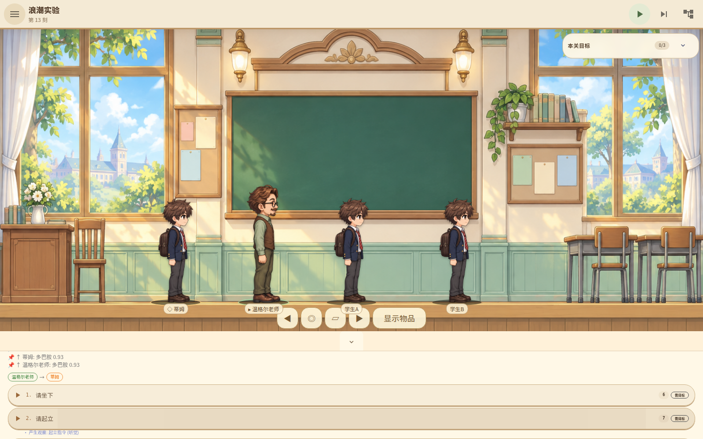
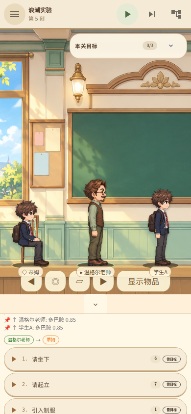

# 实验犬的意义之塔：真实站坐与横卷轴场景试玩

已验收代码：`8453be8891bc59d5d1b1829561f71aa6a943a0b9`，包版本仍为 0.9.0，请以提交号区分。

- [Linux amd64 核心＋网页试玩包](https://github.com/linonetwo/intention-tower/actions/runs/37971167976/artifacts/11635698255)
- [通过的测试 CI](https://github.com/linonetwo/intention-tower/actions/runs/37971167976)
- [124 张真实浏览器截图与报告](https://github.com/linonetwo/intention-tower/actions/runs/37971167976/artifacts/11635523427)
- [本提交三平台安装包构建：全部成功](https://github.com/linonetwo/intention-tower/actions/runs/38025356002)

直接安装试玩（Artifact 保留至 2026-10-24）：

- [Windows：MSI／EXE](https://github.com/linonetwo/intention-tower/actions/runs/38025356002/artifacts/11659889769)
- [macOS Apple Silicon：DMG／App](https://github.com/linonetwo/intention-tower/actions/runs/38025356002/artifacts/11659749410)
- [Linux amd64：AppImage／DEB](https://github.com/linonetwo/intention-tower/actions/runs/38025356002/artifacts/11660154117)

三平台来自同一已验收代码 `8453be8`；尚未完成商店签名和公证，系统可能显示未验证发行者提示。

Linux 核心＋网页包内含正式贴图、预编译核心和网页；需要 Linux amd64 与 Node 22，
解压后按包内 README 启动，无需编译或安装依赖。GitHub Artifact 下载可能需要登录。
手机验收目前是浏览器视口，不是手机原生包或真机性能认证。

## 画面与操作

使用明亮的奶油色、木质房间和全身角色，不是暗色仪表盘。
顶部保留四个主要控制，保存、设置等收进汉堡菜单；界面使用中英本地化。
选中角色后点击场景，移动只取横坐标，脚底保持在当前地面；楼层切换使用场景连接点。
房间背景与人物共用镜头和缩放，手机旋转或缩放时不再因旧坐标动画而瞬间挤叠。

## 浪潮：先教学，再观察实际服从

1. 进入浪潮实验，暂停游戏，并在手册关闭“自动步进”；选择温格老师与蒂姆。
2. 执行“教授手势”并步进；教学建立纪律与行动的联结。
3. 执行“请坐”，步进四次，确认蒂姆实际坐下。
4. 重复“请坐”不会新增服从证据。执行“请起立”并步进四次，确认他实际站起。
5. 对学生 A、学生 B 分别重复教学及站坐。目标要求三名学生各自坐下、起立，不能只训练蒂姆。

动作证据包含教师来源、群体、指令呈现和真实姿态变化；手动站坐不计入服从目标。
同一次指令不会因等待、重复选择或存档恢复反复增加成果。

本包也包含上一批的命令原子回滚和付费社交学习：引入制服后给予认可，
真实缓解孤独需求并按预测误差消耗多巴胺建立联结；同一呈现不会持续刷奖励。
目前认可尚未与某次服从动作严格绑定，外人排斥及撤除老师后的群体自主维持仍待实现，
不能将现有路线过关等同于完整浪潮故事已经完成。

## 验收结果

68 项前端测试、123 项 Rust 测试、22 个 BDD 场景／128 步、21 关现有 MCP 路线通过。
浪潮路线在 tick 35 完成三名学生的六次真实姿态结果。
真实 Chromium 覆盖 46 组桌面／手机视口，124 张截图，无未捕获浏览器错误。
移动端四个人物脚底与后台投影误差均小于 0.016 像素。

仍有关卡语义、动作帧、真机性能及发行签名待完善；这是可试玩增量，不是上架完成声明。

